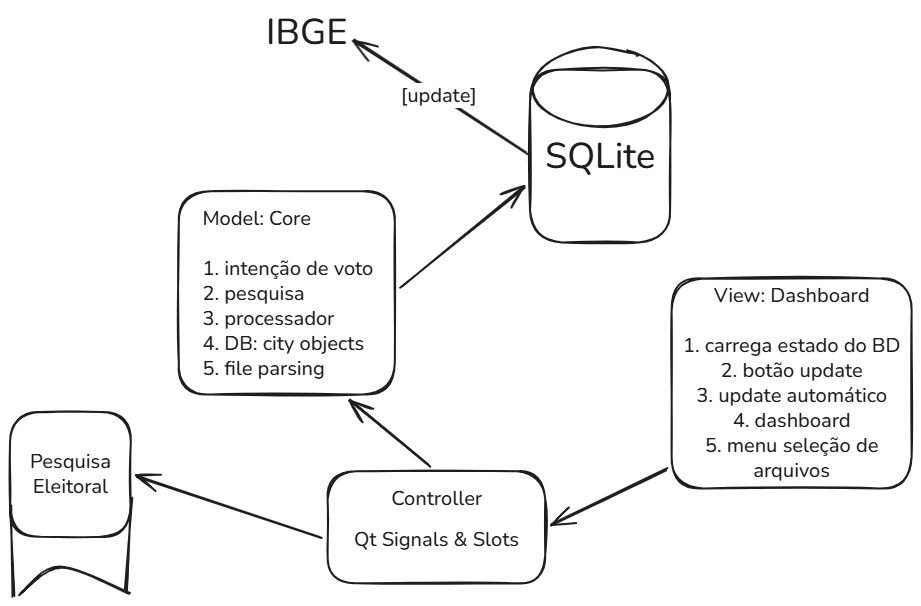
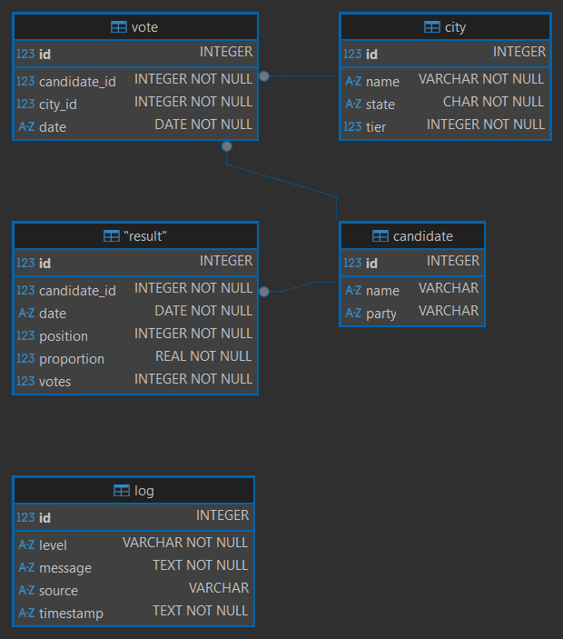
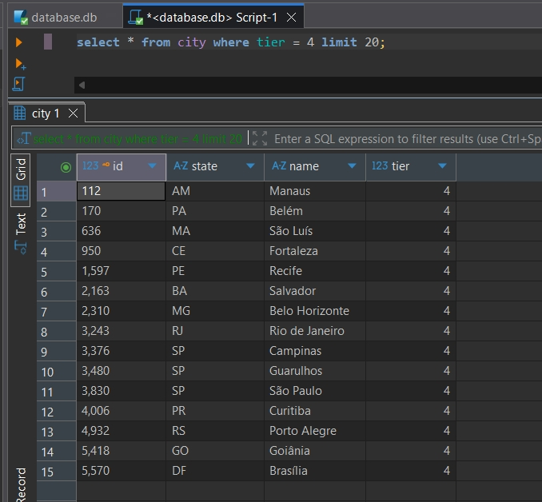
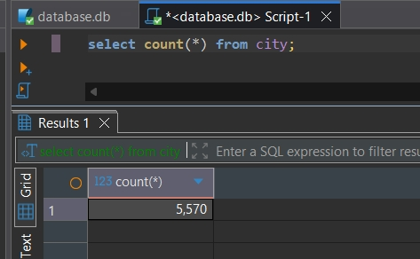

# pesquisa-eleitoral

Teste técnico abordando conhecimentos em C++

## Declaração do Problema

* O sistema tem como objetivo estimar a intenção de votos em eleições para presidente do Brasil.
* Para garantir precisão estatística, a aplicação deve processar dados brutos de pesquisas de campo e aplicar ponderações
  baseadas no porte populacional dos municípios e em diferenças regionais entre os estados.
* Como a demografia muda ao longo do tempo, o sistema requer a integração e atualização contínua de uma base de dados
  geodemográfica como a do IBGE.
* Os resultados processados devem ser consolidados para permitir a visualização e análise da evolução temporal das
  intenções de voto.

## Análise de Requisitos

### Requisitos Funcionais

* **Requisito Funcional 1 - Gestão da Base Demográfica:** O sistema deve sincronizar e armazenar dados atualizados de estados e
  municípios brasileiros a partir de uma base externa como o IBGE. A atualização deve ser executada por um serviço mensal
  ou acionada manualmente pelo usuário. O sistema deve permitir o uso de uma base gerada artificialmente caso a rede externa
  esteja inacessível.

* **Requisito Funcional 2 - Estratificação Municipal:** A aplicação deve classificar os municípios automaticamente em quatro grupos
  de porte populacional para fins de cálculo de intenção de votos:
  * Grupo 1: até 20 mil habitantes.
  * Grupo 2: entre 20 mil e 100 mil habitantes.
  * Grupo 3: entre 100 mil e 1 milhão de habitantes.
  * Grupo 4: acima de 1 milhão de habitantes.

* **Requisito Funcional 3 - Importação de Pesquisas:** O sistema deve importar arquivos contendo os resultados das entrevistas das
  pesquisas eleitorais. A rotina de extração deve mapear obrigatoriamente os seguintes campos:
  * ID da pesquisa
  * Data da pesquisa
  * Município
  * Estado
  * Intenção de voto mapeada pelo ID de cada candidato.

* **Requisito Funcional 4 - Motor de Cálculo Ponderado:** O sistema deve calcular os percentuais finais de intenção de voto.
  O algoritmo de cálculo deve aplicar pesos estatísticos às intenções de voto originais, baseando-se na quantidade real
  de habitantes da região e considerando o estado e o grupo de porte do município.

* **Requisito Funcional 5 - Dashboard Temporal:** A aplicação deve consolidar os cálculos e expor os dados em um dashboard
  simplificado que demonstre a evolução das intenções de voto ao longo do tempo.

### Requisitos Não Funcionais

* **Requisito Não Funcional 1 - Stack Tecnológica:** O núcleo da aplicação, incluindo o motor de ingestão de arquivos
  e algoritmos de cálculo, deve ser desenvolvido em C++.

* **Requisito Não Funcional 2 - Escalabilidade de Candidatos:** A modelagem do cálculo e da base de dados deve ser
  flexível e genérica o suficiente para suportar *n* candidatos dinamicamente, permitindo a reutilização do sistema
  em diferentes cenários eleitorais.

* **Requisito Não Funcional 3 - Longevidade e Desacoplamento:** A arquitetura deve prever uso a longo prazo a cada nova eleição,
  isolando a lógica de requisição e parseamento da base do IBGE para facilitar a manutenção frente a eventuais mudanças
  nas APIs ou formatos de dados governamentais.

## Brainstorming



## Stack

* Core: C++17
* Banco de Dados: SQLiteCpp v3.3.3  
* libcpr v1.14.2  
* nlohmann/json v3.12.0
* Testes: GoogleTest v1.17.0  
* Interface Gráfica: Qt6
* HTTP: cpr  

## Banco de Dados

### Schema  
> Visualização no DBeaver  


### Tabela City Após Atualização Automática  
  
  

## Base Demográfica  

* ### [IBGE](https://servicodados.ibge.gov.br/api/docs/)

* ### [Endpoint](https://servicodados.ibge.gov.br/api/v3/agregados/4714/periodos/2022/variaveis/93?localidades=N6[all])  
  * [Tabela 4714](https://sidra.ibge.gov.br/tabela/4714) - População Residente, Área territorial e Densidade demográfica.  
  * Censo 2022  
  * População Residente: Variável 93  
  * Nível geográfico 6: Municípios   

* ### Endpoint no Teste Unitário    
  * [8 cidades](https://servicodados.ibge.gov.br/api/v3/agregados/4714/periodos/2022/variaveis/93?localidades=N6[2404002,2400109,2402006,2409407,2403251,3549904,2408102,3550308])  

| City                | State | Population (2022) | Tier |
|---------------------|-------|-------------------|------|
| Frutuoso Gomes      | RN    | 4,122             | 1    |
| Acari               | RN    | 10,597            | 1    |
| Caicó               | RN    | 61,146            | 2    |
| Pau dos Ferros      | RN    | 30,479            | 2    |
| Parnamirim          | RN    | 252,716           | 3    |
| São José dos Campos | SP    | 697,054           | 3    |
| Natal               | RN    | 751,300           | 3    |
| São Paulo           | SP    | 11,451,999        | 4    |

## Installation

### Windows

#### Dependencies

1. Install MSYS2 from [msys2.org](https://www.msys2.org) to the standard directory `C:/msys64/`.

2. Launch the **MSYS2 UCRT64** terminal from the Windows Start Menu.  
   

3. Install gcc, cmake, ninja, curl, and ca-certificates:

```bash
pacman -S --needed base-devel mingw-w64-ucrt-x86_64-toolchain
pacman -S mingw-w64-ucrt-x86_64-cmake mingw-w64-ucrt-x86_64-ninja
pacman -S mingw-w64-ucrt-x86_64-curl
pacman -S mingw-w64-ucrt-x86_64-ca-certificates
```

#### Build

```powershell
C:/msys64/ucrt64/bin/cmake.exe -B build
C:/msys64/ucrt64/bin/cmake.exe --build build --config Debug --target all
```